# Guia de usuario - StartupLens

StartupLens es una aplicacion interactiva en Streamlit para estimar la probabilidad de exito de una startup usando un modelo XGBoost, explicar la prediccion con valores SHAP y generar un informe ejecutivo con Llama 3.1 via Groq.

## 1. Requisitos previos

- Python 3.10 o superior.
- Dependencias instaladas desde `requirements.txt`.
- Modelo entrenado en `models/xgboost_model.pkl`.
- Opcional: una API key gratuita de Groq para generar el informe con IA.

## 2. Instalacion

Desde la raiz del repositorio:

```bash
python -m venv venv
venv\Scripts\Activate.ps1
pip install -r requirements.txt
```

Si el archivo `models/xgboost_model.pkl` no existe, generelo con:

```bash
python scratch/recreate_model.py
```

## 3. Configurar Groq

Para usar la pestana de informe IA:

1. Cree una API key en <https://console.groq.com/keys>.
2. Copie `.env.example` como `.env`.
3. Agregue la clave:

```env
GROQ_API_KEY=su_api_key_aqui
```

Para verificar la conexion:

```bash
python scratch/test_groq_connection.py
```

## 4. Ejecutar la aplicacion

```bash
streamlit run app/main.py
```

La aplicacion se abre normalmente en:

```text
http://localhost:8501
```

## 5. Modo de uso


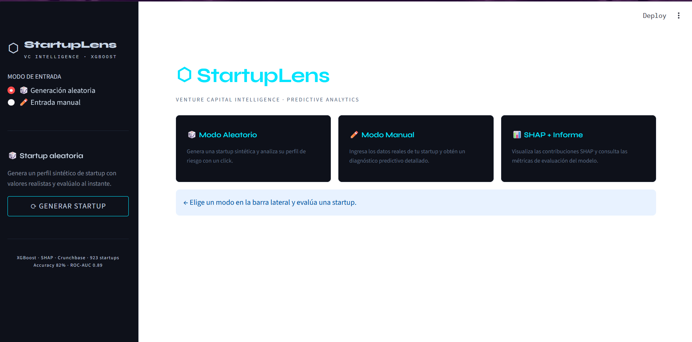

### Modo aleatorio

1. En la barra lateral seleccione `Generacion aleatoria`.
2. Presione `GENERAR STARTUP`.
3. La aplicacion crea un perfil sintetico de startup y calcula automaticamente:
   - probabilidad de exito,
   - veredicto del modelo,
   - principales factores positivos,
   - principales factores de riesgo.

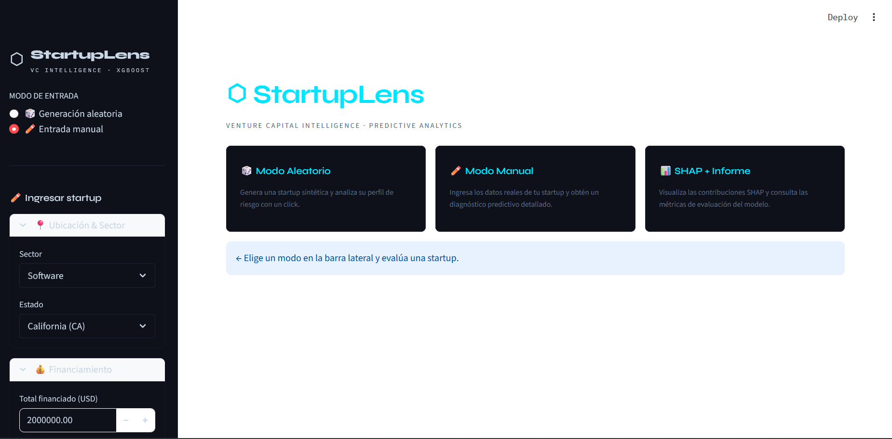

### Modo manual

1. En la barra lateral seleccione `Entrada manual`.
2. Complete los campos de ubicacion, sector, financiamiento, operacion y tiempos de maduracion.
3. Presione `EVALUAR STARTUP`.
4. Revise los resultados en las pestanas principales.

## 6. Pestanas principales

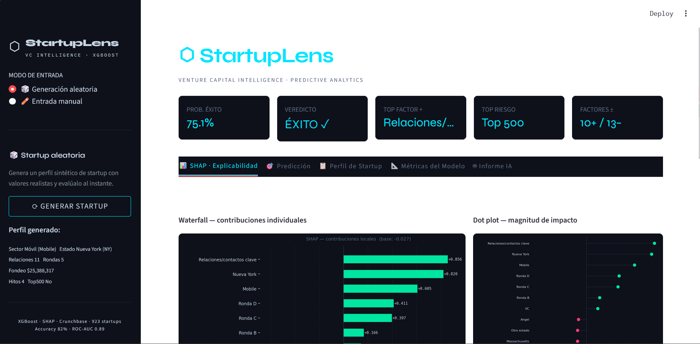
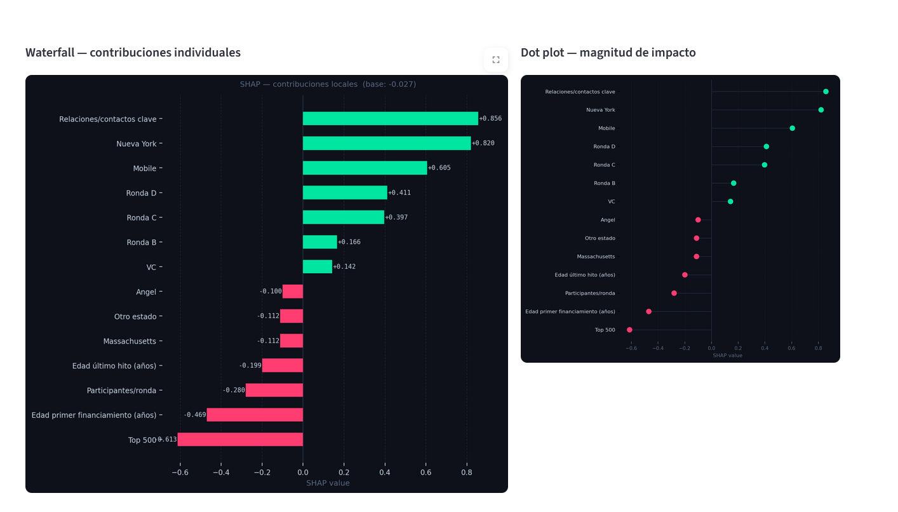
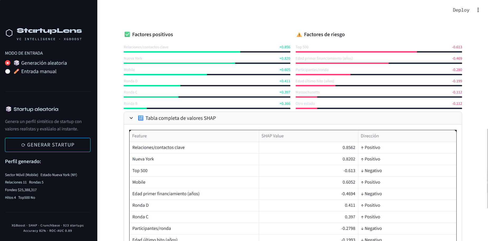

### 6.1. SHAP - Explicabilidad

Esta pestana permite entender por que el modelo tomo una decision para la startup evaluada. No solo muestra si la startup tiene alta o baja probabilidad de exito, sino tambien cuales variables influyeron mas en esa prediccion.

En esta vista se encuentran dos graficos principales:

- `Waterfall - contribuciones individuales`: muestra los factores que empujan la prediccion hacia exito o hacia cierre. Las barras positivas aumentan la probabilidad de exito y las barras negativas la reducen.
- `Dot plot - magnitud de impacto`: resume visualmente las variables con mayor impacto absoluto en la prediccion. Sirve para identificar rapidamente los factores mas importantes.

Debajo de los graficos aparecen dos bloques:

- `Factores positivos`: variables que favorecen la clasificacion como startup exitosa.
- `Factores de riesgo`: variables que reducen la confianza del modelo en el exito de la startup.

Tambien se incluye una tabla completa con todos los valores SHAP. Esta tabla es util para revisar el impacto de cada feature de forma detallada y para conectar la explicacion visual con los datos numericos.

Para interpretar esta pestana, el usuario debe enfocarse en las variables con mayor valor absoluto. Por ejemplo, si `relationships` aparece como factor positivo fuerte, significa que el numero de relaciones o contactos clave de los fundadores esta ayudando a la prediccion. Si una variable aparece con SHAP negativo, se interpreta como una alerta para el perfil evaluado.

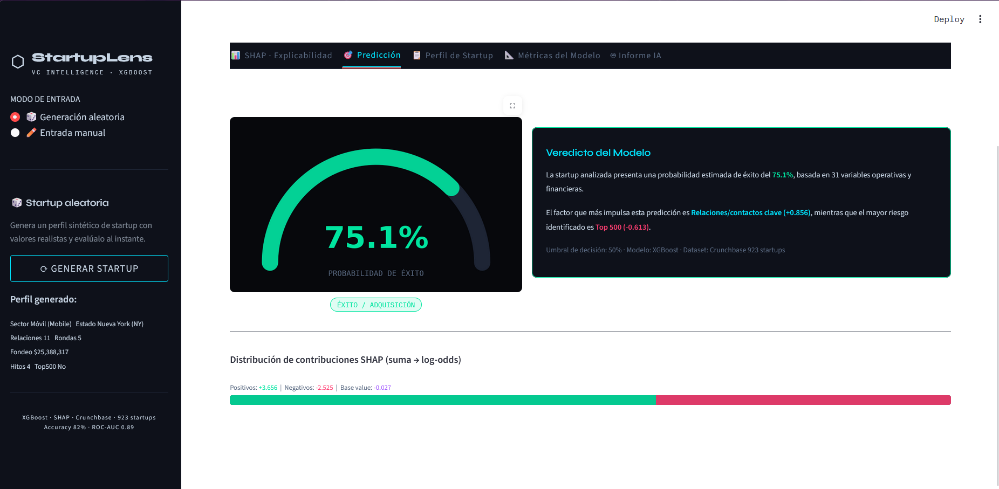

### 6.2. Prediccion

Esta pestana resume la salida principal del modelo. Presenta la probabilidad estimada de exito y el veredicto final de XGBoost usando un umbral de decision del 50%.

Los elementos principales son:

- `Probabilidad de exito`: porcentaje estimado por el modelo para la clase `acquired`.
- `Veredicto`: clasificacion final como `Exito / Adquisicion` o `Cierre / Fracaso`.
- `Top factor positivo`: variable que mas aumenta la probabilidad de exito.
- `Top riesgo`: variable que mas reduce la probabilidad de exito.
- `Factores +/-`: conteo de variables con impacto positivo y negativo relevante.

La grafica tipo medidor permite explicar el resultado de forma rapida durante la demo. Si el porcentaje es mayor o igual al 50%, la startup se clasifica como propensa a exito. Si es menor al 50%, se clasifica como propensa a cierre.

Esta pestana es la mejor para presentar el resultado general a una audiencia no tecnica, porque conecta la probabilidad, el veredicto y los factores principales en una sola vista.

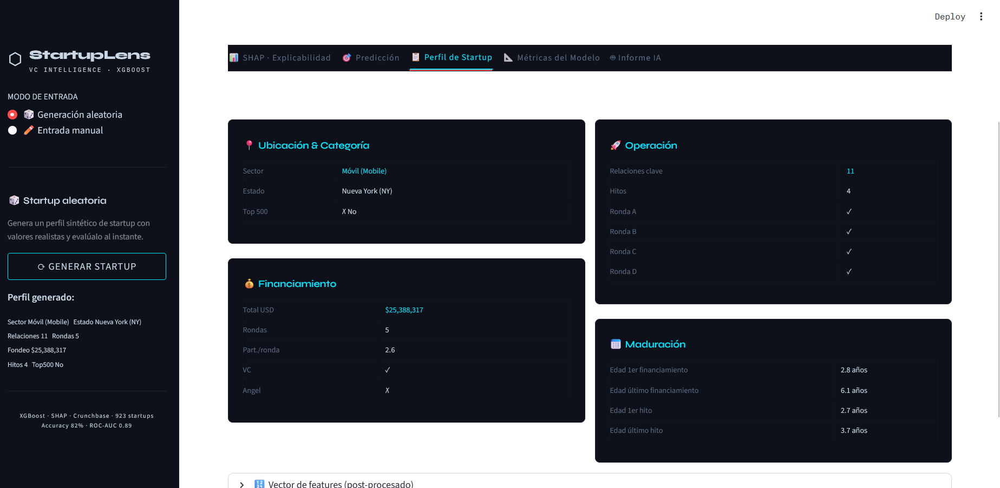
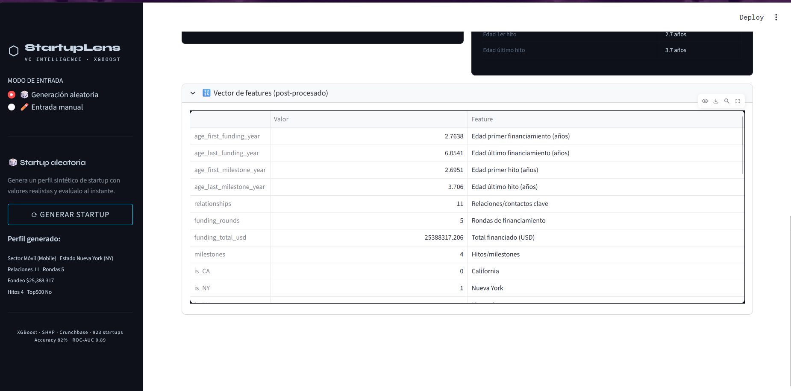

### 6.3. Perfil de Startup

Esta pestana muestra los datos de entrada usados por el modelo. Su objetivo es que el usuario pueda verificar que la startup evaluada corresponde al perfil ingresado en la barra lateral.

La informacion se organiza por bloques:

- `Ubicacion y categoria`: estado, sector e indicador de pertenencia al Top 500.
- `Financiamiento`: monto total financiado, numero de rondas, promedio de participantes por ronda y tipos de inversion recibidos.
- `Operacion`: relaciones clave, hitos alcanzados y rondas completadas.
- `Maduracion`: edad al primer y ultimo financiamiento, y edad al primer y ultimo hito.

Esta vista es importante porque evita interpretar una prediccion sin revisar los datos que la generaron. Si el resultado parece extrano, el primer paso debe ser volver a esta pestana y confirmar que los valores ingresados sean correctos.

Al final se incluye el vector de features post-procesado. Esta tabla muestra como queda representada la startup en las 31 variables usadas por el modelo. Es especialmente util para explicar que el sistema transforma categorias como sector o ubicacion en variables binarias antes de hacer la prediccion.

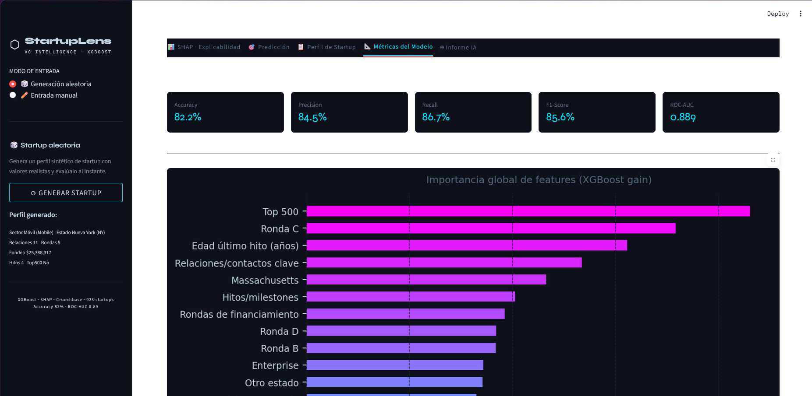
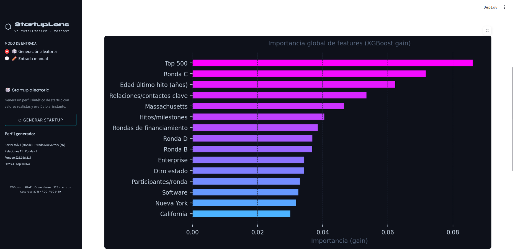
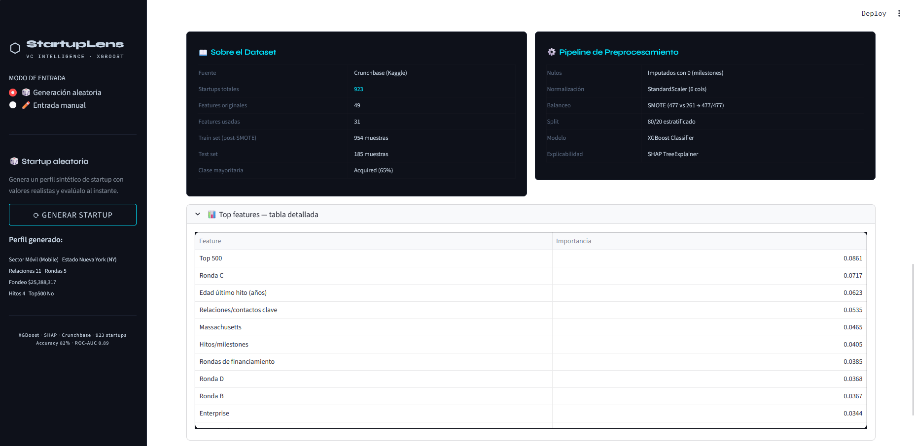

### 6.4. Metricas del Modelo

Esta pestana presenta el rendimiento global del modelo XGBoost en el conjunto de prueba. A diferencia de las pestanas anteriores, que explican una startup individual, esta seccion evalua que tan confiable es el modelo en general.

Las metricas principales son:

- `Accuracy`: porcentaje total de predicciones correctas.
- `Precision`: de las startups predichas como exitosas, cuantas realmente pertenecen a esa clase.
- `Recall`: de las startups exitosas reales, cuantas logro detectar el modelo.
- `F1-Score`: balance entre precision y recall.
- `ROC-AUC`: capacidad del modelo para separar startups exitosas y cerradas a distintos umbrales.

Tambien se muestra la importancia global de las variables del modelo. Esta grafica permite comparar que features son mas relevantes en el comportamiento general de XGBoost, no solo en una prediccion especifica.

Adicionalmente, la pestana resume el pipeline usado:

- dataset de Crunchbase,
- split estratificado 80/20,
- normalizacion con `StandardScaler`,
- balanceo de clases con SMOTE aplicado sobre train,
- entrenamiento con XGBoost,
- explicabilidad con SHAP.

Esta seccion es clave para la evaluacion academica porque demuestra que el sistema no solo genera una prediccion, sino que tambien reporta metricas cuantitativas y documenta el flujo de modelado.

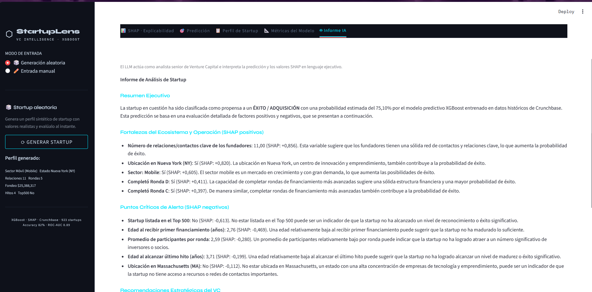

### 6.5. Informe IA

Esta pestana integra el componente de IA generativa del proyecto. A partir de la prediccion del modelo y los valores SHAP locales, el sistema envia un prompt estructurado a Llama 3.1 mediante la API de Groq.

El objetivo no es que el LLM invente una prediccion nueva, sino que traduzca la salida tecnica del modelo en una explicacion ejecutiva comprensible. Por eso el prompt incluye:

- probabilidad de exito calculada por XGBoost,
- veredicto del modelo,
- factores SHAP positivos,
- factores SHAP negativos,
- rol del LLM como analista de Venture Capital,
- estructura esperada del informe.

El informe generado normalmente incluye:

- resumen ejecutivo,
- fortalezas del perfil de la startup,
- puntos criticos de alerta,
- recomendaciones estrategicas.

Para usar esta pestana se necesita configurar `GROQ_API_KEY` en el archivo `.env`. Si la clave no esta configurada o hay un problema de conexion, la app muestra un mensaje de error sin detener el resto del sistema.

Esta vista es muy importante para la demo porque evidencia la integracion entre ML clasico, explicabilidad e IA generativa. La recomendacion es mostrar primero la prediccion y SHAP, y luego abrir esta pestana para demostrar como el LLM convierte esos datos en un informe ejecutivo.

## 7. Interpretacion de resultados

La probabilidad de exito corresponde a la clase `acquired`. Si la probabilidad es mayor o igual a 50%, el sistema clasifica la startup como propensa a exito/adquisicion. Si es menor a 50%, la clasifica como propensa a cierre.

Los valores SHAP explican el impacto local de cada variable:

- SHAP positivo: la variable empuja la prediccion hacia exito.
- SHAP negativo: la variable empuja la prediccion hacia cierre.

## 8. Problemas frecuentes

### La app dice que no encuentra el modelo

Ejecute:

```bash
python scratch/recreate_model.py
```

Luego recargue la aplicacion.

### La pestana Informe IA muestra error de Groq

Revise que el archivo `.env` exista y contenga `GROQ_API_KEY`. Tambien puede ejecutar:

```bash
python scratch/test_groq_connection.py
```

### El dataset crudo no existe

El dataset original debe descargarse desde Kaggle y ubicarse en:

```text
data/raw/startup_data.csv
```

Los archivos procesados ya estan incluidos en `data/processed/`, por lo que la app y los notebooks finales pueden funcionar sin el CSV crudo.

## 9. Recomendacion para la demo

Para el video de demostracion, se recomienda mostrar este flujo:

1. Abrir la app con `streamlit run app/main.py`.
2. Generar una startup aleatoria.
3. Mostrar la probabilidad de exito.
4. Explicar dos factores positivos y dos factores de riesgo en SHAP.
5. Generar el informe IA y leer brevemente el resumen ejecutivo.
